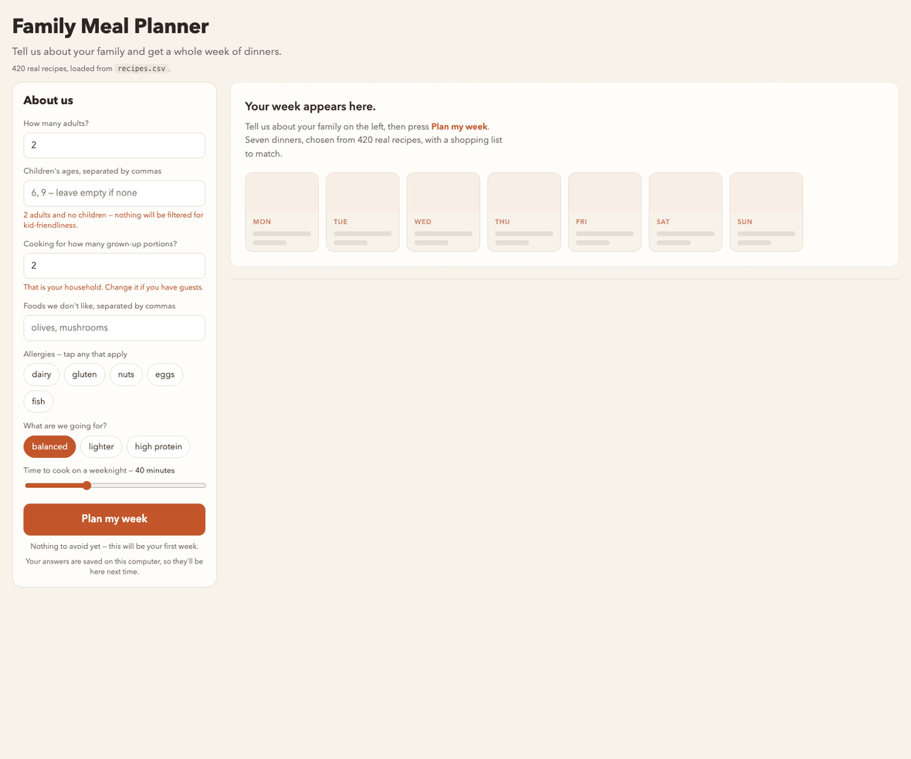

# Family Meal Planner

Built in one afternoon by six people, most of whom had never written code, at
the first Ladies AI session, 23 August 2026.

Tell it about your family and get a week of dinners. Nothing repeats for a
fortnight, the cards flip over to the recipe, and one button turns the week into
a shopping list.



## Try it

**→ [adaptiveinc.github.io/ladies-who-create/meal-planner](https://adaptiveinc.github.io/ladies-who-create/meal-planner/)**

Works on a phone. Nothing to install, no account.

Or run it yourself. `index.html` is the whole app, one file.

- **Double-click it** and it runs with 65 built-in recipes.
- **Serve the folder** and it loads all 420 real recipes from `recipes.csv`:

```bash
python3 -m http.server 8777
```

Then open <http://localhost:8777>.

Everything you type (your family, your allergies, your verdicts on dinners)
stays in your own browser. Nothing is sent anywhere. There is no account.

## What it does

| | |
|---|---|
| **Tell it about you** | Adults, children's ages, allergies, dislikes, nutrition goal, and how long you have to cook on a weeknight |
| **Get a week** | Seven dinners, Monday to Sunday, each a complete meal |
| **Tap a card** | The recipe opens full-size over the week — amounts scaled to how many you're feeding, and a link to the original |
| **No repeats** | Your last 14 dinners stay off the menu, two full weeks |
| **Say what you thought** | 👍 brings a dinner back sooner, 👎 retires it for good |
| **Shop and cook** | One shopping list, grouped by aisle, ready to paste into WhatsApp, plus a printable week |

## What's in the folder

```
index.html              the whole app
recipes.csv             420 real recipes, the data the app reads
tools/build_recipes.py  rebuilds recipes.csv from TheMealDB
tools/make_gif.py       records the walkthrough GIF above
CLAUDE.md               the rulebook the AI re-reads every session
plan.md                 the build plan, in slices, with progress
```

## About the recipes

The dishes, ingredients, method, photos and source links are real, from
[TheMealDB](https://www.themealdb.com/). Each recipe on the back of a card links
to where it came from.

**What is estimated:** prep time, calories, protein and whether a dish is
kid-friendly. TheMealDB doesn't carry those, so they are worked out from the
recipe and clearly labelled as guesses in the app. Cook from them happily; don't
count macros off them.

To rebuild the data yourself:

```bash
python3 tools/build_recipes.py
```

## How this got built

The method matters more than the app, because it works for anything.

**1. Ideas on the whiteboard.** Everyone pitched a problem from their own life.
The group picked the one that was already the right size: a real problem,
small enough to finish.

**2. Cut it to one sentence.** Version zero, written on the wall: *tell it about
your family, get a week of dinners, nothing repeats, one click gives a shopping
list.* When someone later wanted a feature, that sentence settled it.

**3. Write the rulebook before writing the app.** `CLAUDE.md` holds the standing
rules: one file, no server, allergens must be right, no browser dialogs. The AI
re-reads it every conversation, so nobody has to repeat themselves. The catch,
found the hard way: a rule that sneaks in wrong stays wrong all afternoon. The
group deleted one within the first ten minutes.

**4. Slice it.** `plan.md` broke the build into four pieces, each leaving an app
that *works*. Not "the database layer", but "you can fill in a form and see
seven dinners". If the afternoon had run out at slice two, there would still
have been something real to take home.

**5. Build one slice, then look at the screen.** Every slice ended in the
browser with someone trying to break it. This is where the actual work happened
See below.

**6. Fix causes, not symptoms.** When gnocchi turned out to be missing eggs, the
fix wasn't to edit gnocchi. It was to stop hand-labelling allergens altogether
and derive them from the ingredients, which then caught two more mistakes
nobody had spotted.

**7. Swap the toy data for real data last.** The app was built against 65
made-up recipes. Replacing them with 420 real ones at the end changed no logic
at all, because recipes are *data*. Building it the other way round would have
meant fighting real data all afternoon.

### What the room caught

Every one of these came from someone looking at the screen and saying "that's
odd". None came from the AI.

| Someone said | What was actually wrong |
|---|---|
| "We never said no internet" | A constraint invented by the AI and written into the rulebook as if the group had agreed it |
| "Gnocchi has eggs" | Allergens were hand-typed per recipe, so some were missed. A safety bug, not a typo |
| "The food you don't like isn't working" | Dislikes matched literal words only, so "pasta" missed tortellini |
| "Souvlaki alone with no side?" | Eleven dinners weren't complete meals; 29 names didn't say what was on the plate |
| "Why is it avoiding 21?" | Every press of the button counted as a week eaten |
| "I can't click Forget my history" | A browser dialog that gets silently blocked, which looks identical to a broken button |
| "One row for one ingredient" | Three separate merge bugs: clove vs cloves, kg vs g, pieces vs grams |

The lesson the group took away: **the person who can say clearly what's wrong is
doing the most valuable work in the room.** Nobody needed to know how to code to
find every one of these.

## Credits

Recipes and photos: [TheMealDB](https://www.themealdb.com/). Built with
[Claude Code](https://claude.com/claude-code).
